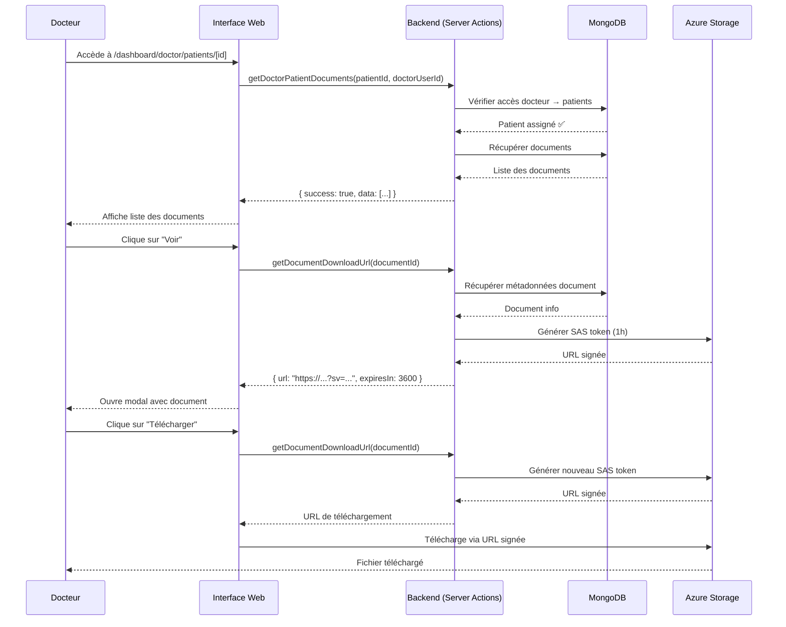

# 👨‍⚕️ Consultation des Documents Médicaux par le Docteur

## 📋 Vue d'ensemble

Cette fonctionnalité permet aux **docteurs** de consulter les documents médicaux uploadés par leurs patients directement depuis la page de détail du patient.

## ✅ Fonctionnalités Implémentées

### 🔒 Sécurité et Permissions

- **Vérification d'accès** : Le docteur peut uniquement voir les documents des patients qui lui sont assignés
- **Authentification SAS** : Utilisation de tokens SAS Azure avec expiration d'1 heure
- **Stockage privé** : Tous les documents sont stockés dans un container Azure privé

### 📄 Affichage des Documents

- **Liste complète** : Tous les documents médicaux du patient dans une interface organisée
- **Filtres par catégorie** :
  - Analyses (ANALYSIS)
  - Imagerie (IMAGING)
  - Ordonnances (PRESCRIPTION)
  - Rapports (REPORT)
  - Résumés de sortie (DISCHARGE_SUMMARY)
  - Consultations (CONSULTATION)
  - Autres (OTHER)
- **Métadonnées** : Nom, date d'upload, taille, description

### 👁️ Visualisation des Documents

- **Visualiseur intégré** : Modal plein écran pour voir les documents
- **Support PDF** : Affichage direct des PDF dans un iframe
- **Support images** : Affichage optimisé des JPG, PNG
- **Fallback** : Message pour les types de fichiers non prévisualisables (DOCX)

### ⬇️ Téléchargement

- **Téléchargement sécurisé** : URL temporaire avec SAS token
- **Nom original** : Le fichier téléchargé garde son nom original

## 🗂️ Fichiers Créés/Modifiés

### Nouveau Composant

**`components/PatientDocumentsViewer.tsx`** (327 lignes)

- Composant React client-side
- Affichage de la liste des documents avec filtres
- Modal de visualisation intégré
- Gestion du téléchargement

### Actions Backend

**`lib/actions/azure-storage.actions.ts`** (ligne 218-258)

- **Nouvelle fonction** : `getDoctorPatientDocuments(patientId, doctorUserId)`
  - Vérifie que le docteur a accès au patient
  - Récupère les documents du patient depuis MongoDB
  - Retourne la liste des documents avec métadonnées

### Page de Détail du Patient

**`app/dashboard/doctor/patients/[id]/page.tsx`**

- Import du nouveau composant `PatientDocumentsViewer`
- Ajout du composant dans la colonne droite (après les symptômes)
- Passage des props : `patientId` et `doctorUserId`

## 🚀 Utilisation

### Pour le Docteur

1. **Accéder à la liste des patients**

   ```
   /dashboard/doctor/patients
   ```

2. **Cliquer sur un patient** pour voir ses détails

   ```
   /dashboard/doctor/patients/[id]
   ```

3. **Section "Documents Médicaux"** en bas de la colonne droite

   - Affiche le nombre total de documents
   - Filtrer par catégorie (boutons en haut)
   - Voir les détails de chaque document

4. **Actions disponibles**
   - 👁️ **Voir** : Ouvre le document dans un visualiseur plein écran
   - ⬇️ **Télécharger** : Télécharge le document sur votre ordinateur

### Interface du Visualiseur

- **En-tête** :

  - Nom du fichier original
  - Catégorie et date d'upload
  - Bouton "Télécharger"
  - Bouton "X" pour fermer

- **Contenu** :
  - **PDF** : Affichage direct avec contrôles de zoom
  - **Images** : Affichage optimisé avec scroll
  - **Autres** : Message + bouton de téléchargement

## 🔐 Sécurité Implémentée

### Vérifications Backend

```typescript
// Vérification d'accès dans getDoctorPatientDocuments()
const doctor = await prisma.doctor.findUnique({
  where: { userId: doctorUserId },
  include: {
    patients: {
      where: { id: patientId },
    },
  },
});

if (!doctor || doctor.patients.length === 0) {
  return {
    success: false,
    error: "You don't have access to this patient's documents",
  };
}
```

### SAS Tokens

- **Durée** : 1 heure (3600 secondes)
- **Permissions** : Lecture seule (read)
- **Régénération** : À chaque demande de visualisation/téléchargement
- **Signature** : Basée sur la clé du compte Azure Storage

## 📊 Données Affichées

Pour chaque document :

```typescript
{
  id: string                    // ID MongoDB
  originalName: string          // Nom original du fichier
  fileName: string              // Nom stocké dans Azure
  fileType: string              // MIME type (application/pdf, image/jpeg, etc.)
  fileSize: number              // Taille en octets
  category: DocumentCategory    // Catégorie du document
  description?: string          // Description optionnelle
  uploadedAt: DateTime          // Date d'upload
  azureBlobUrl: string          // URL de base (sans SAS)
  azureContainerName: string    // Nom du container Azure
  azureBlobName: string         // Nom du blob dans Azure
}
```

## 🎨 Interface Utilisateur

### États du Composant

- **Loading** : Spinner de chargement pendant la récupération des données
- **Liste vide** : Message "Aucun document médical disponible"
- **Liste filtrée vide** : Message "Aucun document dans cette catégorie"
- **Erreur** : Alert avec message d'erreur

### Catégories avec Icônes

| Catégorie         | Icône         | Label             |
| ----------------- | ------------- | ----------------- |
| ANALYSIS          | Activity      | Analyses          |
| IMAGING           | Image         | Imagerie          |
| PRESCRIPTION      | Pill          | Ordonnances       |
| REPORT            | ClipboardList | Rapports          |
| DISCHARGE_SUMMARY | FileText      | Résumés de sortie |
| CONSULTATION      | Heart         | Consultations     |
| OTHER             | FolderOpen    | Autres            |

## 🧪 Tests à Effectuer

### ✅ Checklist de Test

1. **Accès et Permissions**

   - [ ] Le docteur peut voir les documents de ses patients assignés
   - [ ] Le docteur ne peut PAS voir les documents d'autres patients
   - [ ] Message d'erreur si accès non autorisé

2. **Affichage**

   - [ ] Liste complète des documents affichée
   - [ ] Filtre "Tous" fonctionne
   - [ ] Filtres par catégorie fonctionnent
   - [ ] Compteurs corrects pour chaque catégorie
   - [ ] Métadonnées affichées correctement (nom, date, taille)

3. **Visualisation**

   - [ ] Clic sur "Voir" ouvre le modal
   - [ ] PDF s'affiche correctement dans l'iframe
   - [ ] Images s'affichent correctement
   - [ ] Message de fallback pour DOCX
   - [ ] Bouton "X" ferme le modal
   - [ ] Clic en dehors du modal le ferme

4. **Téléchargement**

   - [ ] Bouton "Télécharger" dans la liste lance le téléchargement
   - [ ] Bouton "Télécharger" dans le modal lance le téléchargement
   - [ ] Nom du fichier téléchargé est l'original
   - [ ] Contenu du fichier téléchargé est correct

5. **Sécurité**
   - [ ] URL contient un SAS token (?sv=...&sig=...)
   - [ ] Accès direct sans SAS token est refusé (403)
   - [ ] Token expire après 1 heure
   - [ ] Nouveau token généré à chaque demande

## 🐛 Dépannage

### Erreur : "You don't have access to this patient's documents"

**Cause** : Le patient n'est pas assigné au docteur
**Solution** : Vérifier l'assignation dans la base de données

```sql
-- Vérifier l'assignation
SELECT * FROM Doctor WHERE userId = 'DOCTOR_USER_ID';
SELECT * FROM _DoctorPatients WHERE A = 'DOCTOR_ID' AND B = 'PATIENT_ID';
```

### Erreur : "Document not found"

**Cause** : Le document a été supprimé ou n'existe pas
**Solution** : Recharger la liste des documents

### Erreur : "PublicAccessNotPermitted"

**Cause** : Tentative d'accès sans SAS token
**Solution** : Régénérer le Prisma client et redémarrer le serveur

```bash
npx prisma generate
npm run dev
```

### PDF ne s'affiche pas

**Cause** : Bloqué par le navigateur ou erreur CORS
**Solution** :

1. Vérifier la console pour les erreurs
2. Utiliser le bouton "Télécharger" comme alternative
3. Vérifier les paramètres SAS dans Azure

## 🔄 Workflow Complet



## 📚 Ressources Connexes

- **Documentation Azure Storage SAS** : [AZURE_STORAGE_SAS.md](./AZURE_STORAGE_SAS.md)
- **Documentation Upload Patient** : [UPLOAD_DOCUMENTS.md](./UPLOAD_DOCUMENTS.md)
- **API Azure Blob Storage** : https://learn.microsoft.com/azure/storage/blobs/

## 🎯 Prochaines Améliorations

### Phase 2 (Optionnel)

- [ ] Permettre au docteur d'ajouter des commentaires sur les documents
- [ ] Notification au patient quand le docteur consulte un document
- [ ] Historique des consultations de documents
- [ ] Annotation de documents (surlignage, notes)
- [ ] Export groupé des documents d'un patient
- [ ] Partage sécurisé avec d'autres docteurs

### Phase 3 (Avancé)

- [ ] Comparaison de résultats d'analyses (avant/après)
- [ ] Détection automatique de données critiques dans les documents
- [ ] Intégration OCR pour extraire du texte des images
- [ ] Génération automatique de résumés par IA
- [ ] Timeline visuelle des documents

---

**Date de création** : 3 mars 2026
**Version** : 1.0.0
**Compatibilité** : Next.js 14+, Azure Blob Storage, MongoDB + Prisma
